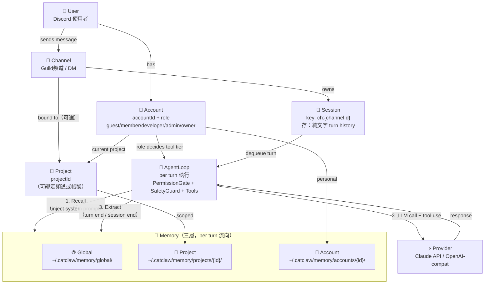

# CatClaw 架構關係圖

## 實體關係 + 記憶流向



## 說明

### 綁定關係
| 關係 | 說明 |
|------|------|
| User → Account | 每個 Discord 使用者對應一個 Account，含 role |
| Channel → Session | Guild 頻道共用一個 Session；DM 各自獨立 |
| Channel/Account → Project | 頻道可 bound project；帳號可設 current project |
| Account → 記憶層 | role 決定能用哪些 tool tier；accountId 對應個人記憶 |

### 記憶流向（per turn）
```
User 說話
  → Session 取得 history（純文字，無 tool result）
  → AgentLoop [1] Recall：全域 + 專案 + 帳號三層合併注入 system prompt
  → AgentLoop [2] LLM call + tool use（Provider 執行）
  → AgentLoop [3] Extract：turn 結束後萃取知識寫回三層記憶
```

### Session 說明
- Tool results **不存入** session history（只存最終文字 response）
- Guild 頻道：同頻道所有人共用一個 Session（session key = `ch:{channelId}`）
- DM：每個使用者各自獨立 Session
- TTL：預設 168h（7天）閒置後過期

### Agent 路由（--agent <id>）
- `node dist/index.js --agent support-bot`
- deepMerge(base config, agents.support-bot)
- 資料路徑隔離：`~/.catclaw/agents/support-bot/`
