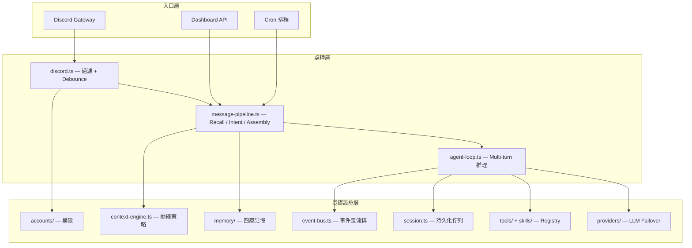

# Architecture

## 整體架構

CatClaw 採用**管線式架構**，訊息從 Discord 進入後經過多層處理，最終由 Agent Loop 驅動 LLM 完成推理與工具執行。



## 資料流

一則 Discord 訊息的完整生命週期：

```text
1. Discord messageCreate 事件
2. discord.ts — bot 自身過濾、channel 權限檢查、mention 檢查
3. Debounce — 500ms 內同作者多則訊息合併
4. 身份解析 — Discord userId → CatClaw accountId（含 guest 自動建立）
5. message-pipeline.ts:
   a. Memory Recall（向量 + 關鍵字搜尋）
   b. Intent Detection（coding / research / conversation）
   c. Mode Extras 載入
   d. System Prompt Assembly（模組化組裝 + module filter）
   e. Inbound History 注入（可選）
6. agent-loop.ts:
   a. Permission Gate — 依角色過濾可用 tools
   b. Turn Queue — 排入 per-session 佇列
   c. Context Engine — 壓縮歷史訊息
   d. LLM Stream Loop（最多 20 輪）
   e. Tool 執行 + before/after hooks
   f. Output Token Recovery（最多 3 次續接）
7. reply-handler.ts — Streaming 分段回覆到 Discord
8. Memory Extract — 非同步萃取新知識（fire-and-forget）
```

## Platform 初始化

`platform.ts` 的 `initPlatform()` 按順序初始化所有子系統：

| 順序 | 子系統 | 說明 |
| ---- | ------ | ---- |
| 1 | AccountRegistry | 載入帳號、自動建立 platform-owner |
| 2 | ToolRegistry | 載入 builtin tools、啟用 hot-reload |
| 3 | PermissionGate | 初始化角色-工具權限閘門 |
| 4 | SafetyGuard | 安全攔截設定 |
| 5 | ProviderRegistry | LLM Provider 註冊 + failover chain |
| 6 | SessionManager | Session 持久化、TTL 清理、載入現有 session |
| 7 | Registration + IdentityLinker | 使用者註冊 + 身份綁定 |
| 8 | EmbeddingProvider / ExtractionProvider | 記憶管線抽象層（ollama / google / openai / voyage / anthropic 等），啟動時 `verify?()` fail-loud + Health Monitor 接線 |
| 9 | MemoryEngine | 四層記憶引擎初始化（global / project / agent / atom） |
| 10 | RateLimiter | 角色級速率限制 |
| 11 | ContextEngine | 壓縮策略鏈初始化 |
| 12 | SubagentRegistry | 子任務並行限制 |
| 13 | CollabConflictDetector | 多人衝突偵測 |
| 14 | Dashboard | Web Dashboard + Trace |
| 15 | WorkflowEngine | 背景萃取/鞏固/rut 偵測 |
| 16 | MCP Servers | MCP 連線（可選） |
| 17 | HookRegistry | 使用者自訂 hooks |

所有子系統透過 singleton accessor（`getPlatformToolRegistry()` 等）全域存取。

## 分層讀取（對齊 Claude Code）

CatClaw 三層讀取：**全域 → 角色（agent） → 專案（bound project）**。每層注入 / 載入時機與機制：

| 維度 | 全域 `~/.catclaw/` | 角色 `agents/{id}/` | 專案 `bound project cwd` | 機制 |
|------|--------------------|--------------------|--------------------------|------|
| CATCLAW.md / CLAUDE.md | `workspace/CATCLAW.md`（含父目錄遞迴） | `agents/{id}/CATCLAW.md` | `{cwd}/CLAUDE.md`（bound project） | `prompt-assembler.ts:loadCatclawMdHierarchy` + `claudeMdModule`；全部支援 `@import` 展開（**對齊 Claude Code**） |
| Memory | `~/.catclaw/memory/global/` | `agents/{id}/memory/` | `~/.catclaw/memory/projects/{id}/` | recall 自動分層；`atom_write` 按 scope（global/agent/project）路由 |
| Skills | `~/.catclaw/skills/`（外部） + 內建 `dist/skills/builtin*/` | `agents/{id}/skills/`（**Phase 5 接線**） | — | `index.ts` 啟動時依序載入：builtin → ~/.catclaw/skills → agent skills |
| Hooks | `workspace/hooks/` + `catclaw.json.hooks[]` | `agents/{id}/hooks/` | — | `HookScanner` 自動掃描；fs.watch 熱重載 |
| 設定 | `catclaw.json` + `models-config.json` | `agents/{id}/config.json`（deep-merge） | — | 全域設定為基底，agent config 覆寫 |
| MCP servers | `catclaw.json.mcpServers{}` | —（共用全域） | — | `platform.ts` 啟動每個 MCP server |

### `_AIDocs/_INDEX.md` 自動注入

Bound project 啟動的 turn 內，`prompt-assembler.ts:aidocsIndexModule`（priority=13）自動偵測 `{projectCwd}/_AIDocs/_INDEX.md`：

- 存在 → 注入 system prompt 為「## 專案知識庫索引」段
- 上限 4000 chars（_INDEX.md 通常 < 1000，超過 truncate 加警示）
- agent 看到索引後用 `read_file` 按需取 `_AIDocs/{filename}.md` 詳細內容（不會自動把全部 _AIDocs 內容塞 system prompt）
- 不存在/讀失敗 → fail-soft 回空字串，不影響其他模組

對齊 `~/.claude` 那邊 SessionStart 注入 `_AIDocs/_INDEX.md` 的機制，但走純 TS module 不依賴 Python hooks。

### `@import` 語法（CLAUDE.md / CATCLAW.md 內）

支援 Claude Code 標準 `@<path>` 整行語法，自動展開為檔案內容：

```markdown
# 啟動設定
@IDENTITY.md
@USER.md
@memory/MEMORY.md
```

- base dir = 該檔案所在目錄（global CATCLAW.md base 是 workspace；agent CATCLAW.md base 是 agent data dir；project CLAUDE.md base 是 project cwd）
- 支援巢狀（seen set 防無限循環）
- 失敗（檔不存在 / 讀失敗）保留警示註解，不阻斷其他內容
- 實作：`prompt-assembler.ts:expandClaudeMdImports`

## Project Binding & Scope

Bound project 把 agent 在特定頻道內的工作脈絡切到指定專案，影響三維度：

| 維度 | 切換目標 | 機制 |
|------|---------|------|
| CWD | `project.toolsDir` 或 `~/.catclaw/workspace/data/projects/{id}/` | agent-loop 注入 `ctx.projectCwd`；`run_command` / `read_file` / `write_file` / `edit_file` 相對路徑用此為 base |
| Memory | `~/.catclaw/memory/projects/{id}/` | recall 自動加 `project/{id}` namespace；`atom_write` 預設 scope=project |
| System Prompt | `{project.cwd}/CLAUDE.md`（若存在） | 注入 `catclaw-md` module 末段，agent 看到 project 規則 |

### 啟動條件

turn 取得 projectId 的優先序（discord.ts:825 附近）：

1. **頻道綁定**：`catclaw.json` → `discord.guilds.{guildId}.channels.{channelId}.boundProject`
2. **Agent 綁定**：`agents/{agentId}/config.json` → `boundProject` — 讓特定 agent（如露米）DM / 跨 channel 始終綁定同 project
3. **帳號當前專案**：`account.projects[0]`（fallback）
4. 都沒設 → undefined → 走全域（CWD = catclaw 啟動目錄，memory = global namespace）

DM 訊息無 guild → channel.boundProject 不適用，自動退到 agent.boundProject。

### Dashboard 編輯

Dashboard「**設定（Config）**」分頁底下有兩棵設定樹（樹狀 `<details>` 可折疊區段）：

1. **Agent 設定**（寫回 `agents/{id}/config.json`）— 每個 agent 一個區段，可編輯 `boundProject` 等白名單欄位。
2. **catclaw.json**（完整編輯）— 整份全域設定 JSON 編輯器，含 Discord / Guilds / providers / ... 全部區段。

> Agent 設定不放「憑證（Auth）」分頁 — Auth 分頁語意是憑證/模型認證（Auth Profiles / Models Config / models.json）；Agent 行為設定（boundProject 是「綁定到哪個專案目錄」）屬於 Config 範疇。修改後 `./catclaw restart` 才生效。

### 程式路徑

```
discord.ts 收訊息
  → resolveDiscordIdentity → accountId
  → 取 ChannelAccess.boundProject ?? account.currentProject = projectId
  → 呼叫 runAgentLoop({ projectId, ... })
       agent-loop 在 turn 開頭：
         ProjectManager.resolveBinding(projectId, memoryRoot) → { cwd, memoryDir, claudeMd }
         注入 ToolContext.{projectCwd, projectMemoryDir, projectClaudeMd}
       message-pipeline 在組 systemPrompt 時：
         呼叫同 resolveBinding 取 claudeMd 給 prompt-assembler.claudeMdModule 注入
       memory engine recall：
         RecallContext.projectId 帶過去 → layerToNs("project") = `project/{id}`
```

### Fail-soft

`projectId` 指向不存在的 project / ProjectManager 未初始化 → `binding=null`，log.warn 後仍跑（CWD 回 catclaw 啟動目錄、memory 回 global）。

## 設計原則

- **One-Track Control**：LLM 只負責思考與決策，所有工具執行由 CatClaw 控制
- **Registry Pattern**：Tool / Skill / Provider 皆透過 Registry 動態註冊，支援 hot-reload
- **Strategy Pattern**：Context Engine 的壓縮策略可插拔、可組合
- **Fire-and-Forget**：Memory Extract 等非關鍵路徑採非同步執行
- **Atomic Persistence**：Session 寫入用 `.tmp` → rename，確保 crash-safe
- **程式碼與資料分離**：`~/project/catclaw/` 純程式碼，`~/.catclaw/` 使用者資料
