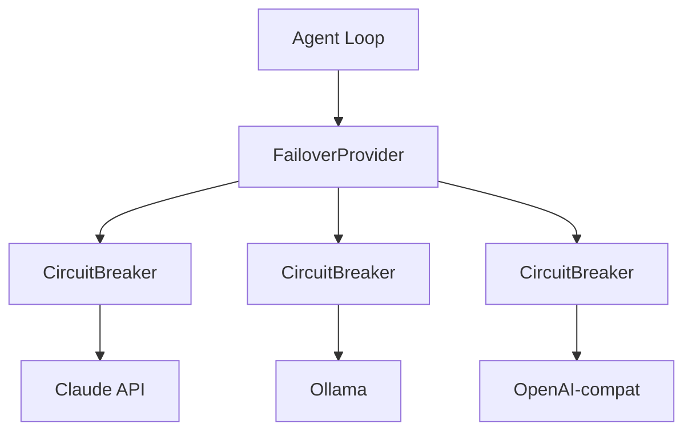

# Provider System

`src/providers/` — LLM 抽象層，支援多 provider failover 與 circuit breaker。

## 架構



## Provider 介面

所有 provider 實作 `LLMProvider` 介面：

```typescript
interface LLMProvider {
  id: string
  modelId: string
  supportsToolUse: boolean
  init(): Promise<void>
  stream(messages, tools, opts): AsyncGenerator<StreamEvent>
  shutdown(): Promise<void>
  /** 可選：啟動健康檢查（host 可達 + model 存在），給 runStartupHealthCheck 用 */
  verify?(): Promise<{ ok: boolean; error?: string }>
}
```

實作 `verify()` 的 provider 會被 `runStartupHealthCheck` 自動納入 Component Health；目前 `OllamaProvider` 已實作，其他 provider 可漸進補。Dashboard `/api/health` 端點會回 `llm:{provider}/{model}：reachable` 條目。

## 支援的 Provider

| Provider | 說明 |
| -------- | ---- |
| `claude` / `claude-oauth` | Anthropic Claude API（V2 使用 `claude-oauth` + OAuth token） |
| `openai-compat` | OpenAI-compatible API（任何相容端點） |
| `ollama` | 本地 Ollama 推理 |
| `codex-oauth` | OAuth-based Codex；**共用 `~/.codex/auth.json` 與 Codex CLI**（避免雙方 refresh 互踩），支援 nested 格式 + JWT exp 解析（4-23） |
| `cli-claude` | Spawn Claude CLI（ACP 路徑），可走 control_request 互動權限審批 |
| `cli-gemini` | Spawn Gemini CLI |
| `cli-codex` | Spawn Codex CLI；繼承全域 `~/.codex` 設定，approval decision 採用新 enum API |

> **內建模型清單**：自 4-26 起改從 `@mariozechner/pi-ai` 動態抽取（`buildBuiltinProviders()`），pi-ai 升版重啟自動帶新 provider/model。Dashboard 模型快捷依「auth-profile.json 的 provider」動態分組。

## ProviderRegistry

路由決策優先序：

```text
channels[channelId] → projects[projectId] → roles[role] → defaultId
```

支援 per-channel、per-project、per-role 指定不同 provider。

## Failover 機制

`FailoverProvider.stream()` 的處理流程：

1. 依序嘗試 failover chain 中的 provider
2. 跳過 circuit breaker 為 open 狀態的 provider
3. 成功 → `breaker.recordSuccess()`，回傳結果
4. 4xx 錯誤（非 429、非 quota）→ 不記錄失敗，直接拋出（用戶端錯誤不算 provider 問題）
5. **5xx / 429 / quota error / 網路錯誤** → `breaker.recordFailure()`，嘗試下一個（4-26：quota error 也觸發 failover，避免長時間掛死在已耗盡的 provider）
6. 全部失敗 → 拋出合併錯誤訊息

## Circuit Breaker

三態狀態機：

```text
        ┌─ success ─┐
        ↓            │
    [Closed] ──errorThreshold──→ [Open]
        ↑                          │
        │                     cooldown elapsed
        │                          ↓
        └── success ──────── [Half-Open]
                                   │
                              failure → [Open]
```

| 參數 | 預設 | 說明 |
| ---- | ---- | ---- |
| `errorThreshold` | 3 | windowMs 內失敗幾次觸發 open |
| `windowMs` | 60,000 ms | 失敗計數視窗 |
| `cooldownMs` | 30,000 ms | open 後冷卻時間 |

**Half-Open** 狀態只允許一次試探請求：成功 → 回到 closed，失敗 → 回到 open。

## 輔助模組

| 模組 | 檔案 | 說明 |
| ---- | ---- | ---- |
| AuthProfileStore | `auth-profile-store.ts` | 多憑證管理（API key / token / OAuth），Round-Robin 選取 + Cooldown 追蹤 + 持久化 |
| ModelRef | `model-ref.ts` | Model alias 解析，支援 `"provider/model"` 格式與短別名（如 `"sonnet"` → `anthropic/claude-sonnet-4-6`） |
| ModelsConfig | `models-config.ts` | V2 多模型設定，管理 `models.json` 產生與載入（內建目錄 + catclaw.json 自訂覆寫） |
| migrateV1ToV2 | `migration/v1-to-v2-provider.ts` | V1 → V2 設定遷移；偵測 catclaw.json 內 `provider`/`providers`/`providerRouting`/`agentDefaults` 自動搬到 `models-config.json` + 備份 |

## 設定來源（V2 三層分離）

對話 LLM 設定的**唯一真相源**：

| 項目 | 位置 | 編輯方式 |
| ---- | ---- | -------- |
| 當前模型 `primary` + `aliases` | `~/.catclaw/models-config.json` | Dashboard Auth 分頁 / `/configure` skill / 手動編輯 |
| 自訂 `providers.{name}`（如遠端 ollama） | `~/.catclaw/models-config.json` | 手動編輯後 `./catclaw restart` |
| 憑證 token / API key | `~/.catclaw/workspace/agents/default/auth-profile.json` | Dashboard Auth 分頁 |
| Memory pipeline 用 Ollama（embedding/extraction） | `~/.catclaw/catclaw.json` 內 `ollama` 區塊 | Dashboard Pipeline 頁「Ollama 後端設定」卡（即時熱重載 ~500ms） |

> **重要**：對話 LLM 跟 memory pipeline 用的 Ollama 是**兩條獨立路徑**（前者走 `OllamaProvider`，後者走 `OllamaClient`），host/model 不共用。

### 從 V1 升級

舊版 `catclaw.json` 包含的 `provider` / `providers` / `providerRouting` 與短暫存在的 `agentDefaults` 區塊已廢棄。`platform.ts` 啟動時自動偵測並執行 `migrateV1ToV2()` 把它們搬到 `models-config.json` 並從 `catclaw.json` 移除（自動備份 `.bak.{timestamp}`）。手動觸發：

```bash
./catclaw migrate-v2 --dry-run       # 預覽
./catclaw migrate-v2                  # 實跑
```

特殊情況：
- V1 provider 帶 `token` / `password` → migration 列入 `requiresManualReview`，需手動移到 `auth-profile.json`
- `providerRouting.roles` 引用 V1 provider ID → 整段 `providerRouting` 已刪除；如需 channel/role routing 改用 `models-config.json` 內 routing 或 dashboard 設定

## 對話 LLM 健康監控

`platform.ts:runStartupHealthCheck` 啟動時遍歷 `ProviderRegistry.listProviders()`，對實作 `verify()` 的 provider 跑檢查，結果寫入 health-monitor。Dashboard `🩺 Component Health` 面板會顯示 `llm:{providerId}/{modelId}：reachable | unreachable`。OllamaProvider 的 verify 跑 `/api/show` 驗 host 可達 + model 存在。
